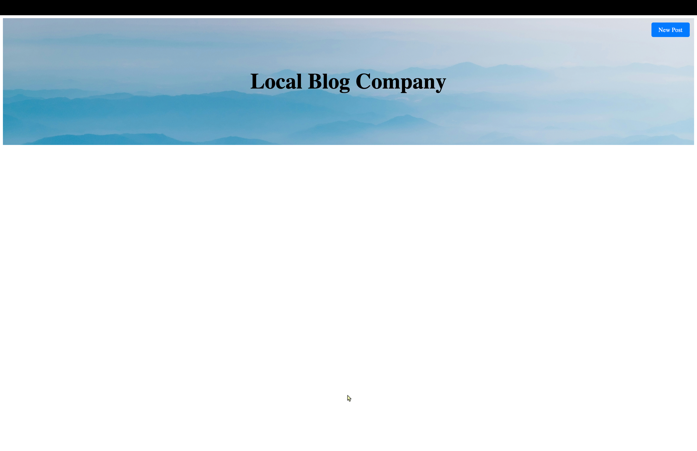
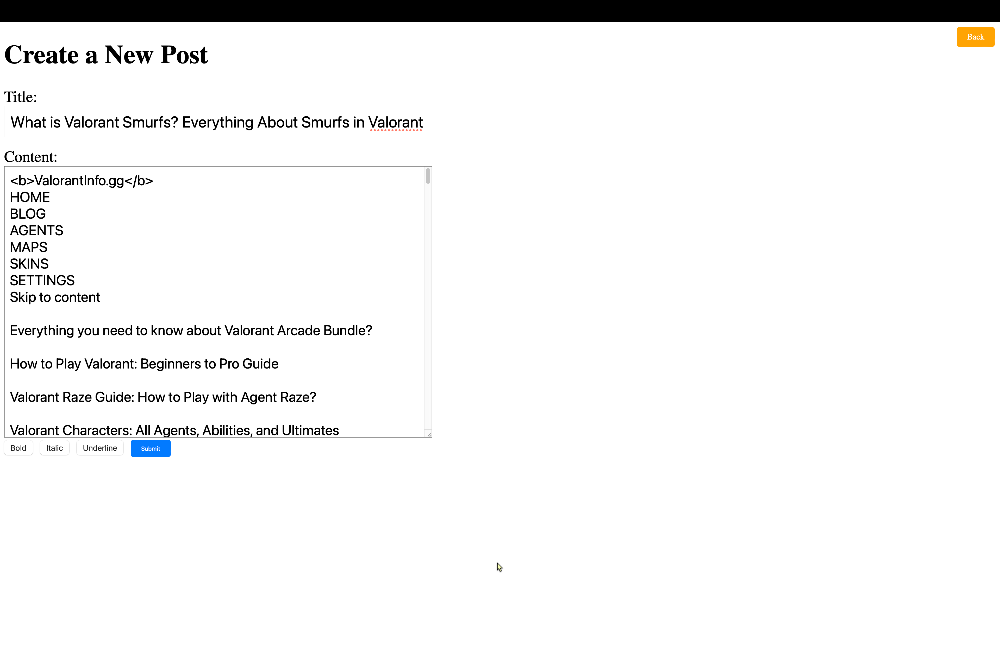
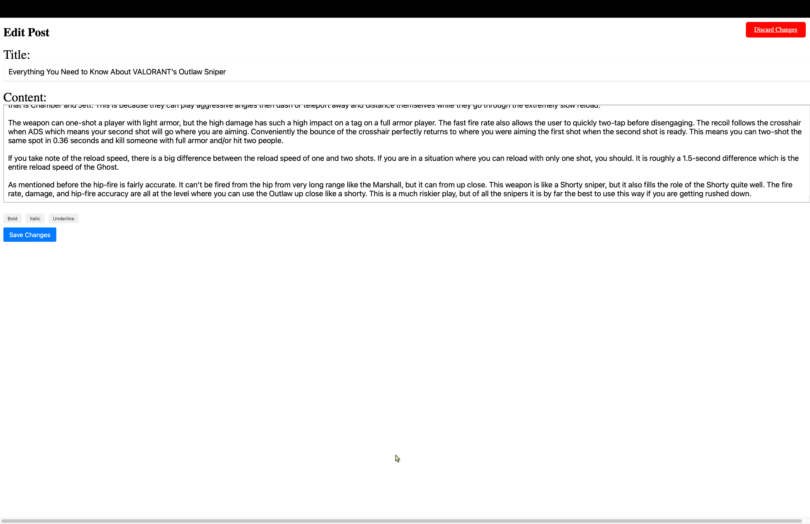

# Data 605 Project
## Rahul Velaga - 120377273 May 2024

## RethinkDB 

RethinkDB is a NoSQL database designed to handle realtime data. This database stores JSON documents with dynamic schemas and is designed to facilitate pushing realtime updates for query results to applications. RethinkDB uses the ReQL query language, an embedded domain specific language. It is available for Ruby, Python, Java and JavaScript. Its has support for table joins, groupings, aggregations and functions. 

A distinguishing features of RethinkDB is the first class support for realtime change feeds. A change query returns a cursor which allows blocking or non blocking requests to keep track of a potentially infinite stream of realtime changes. 

RethinkDB's query language, ReQL, is designed with reactive programming principles in mind. It allows developers to express complex data transformations and subscribe to query results, enabling reactive programming paradigms. This feature is particularly advantageous for building interactive applications with dynamic data requirements.

While many databases support horizontal scalability, RethinkDB simplifies the process by offering built-in support for sharding and cluster management. This allows the database to scale transparently as data volume and workload increase, without requiring significant manual intervention or complex configuration.

RethinkDB provides a range of developer-friendly tools and integrations, including client libraries for various programming languages, administration and monitoring tools, and integration with popular frameworks and platforms. This ecosystem simplifies development, deployment, and management tasks, reducing the time and effort required to build and maintain applications.

### Pros 

- RethinkDB is built for realtime applications, offering native support for change feeds that enable devs to subscribe for live updates.
- RethinkDB employs a distributed architecture that ensures high availability, fault tolerance, and scalability. Each node in the cluster is equal and autonomous, facilitating seamless scaling and resilience in distributed environments.
- RethinkDB integrates well with Docker, facilitating easy deployment and management of database instances using containerization technology.

### Cons 

- RethinkDB's ecosystem is immature compared to other NoSQL databases. This could result in limited third-party tools, integrations, or support resources compared to more established alternatives.
- In some scenarios, RethinkDB's performance may degrade under heavy write loads, especially when dealing with large volumes of concurrent write operations. 
- Migrating data from existing databases to RethinkDB can be challenging, particularly when transitioning from relational databases with different data models.

#### Sources 
- https://rethinkdb.com/docs/guide/python/

- https://en.wikipedia.org/wiki/RethinkDB

## Containers Involved

The docker-compose for this project has two containers:

- One to host the blog application named as 'blog'. The image is also tagged as 'blog' and it exposes to port '5001' to the host system for accessing the blog application.
- Two for the RethinkDB database named as 'rethinkdb'. It is pulled from the official RethinkDB Docker image available on the Docker Hub. This container exposes ports '8080', '28015', '29015' for accessing RethinkDB;s web interface, client driver connections and communication between clusters respectively. 

## Communication between containers

The docker compose creates a new Docker Network named 'blognet'. Both the containers are connected to this Docker Network allowing them to communicate with each other securely and effeciently. The **'depends_on'** field in the **'blog'** service ensures that the blog application container starts only after the RethinkDB container is up and running, ensuring the application can establish connections to the database without errors.

## Logic of the Docker System 

- The 'blog' container hosts the blog application and its built from a docker-compose.yml specified in the project folder. The Docker-compose contains the instructions for setting up the app environment, installing dependencies and configuring the application. This app is build locally, so any changed make to .yml file or the code will be reflected in the contianer. 
- The 'rethinkdb' container directly works on the RethinkDB database and it requires 3 ports. Port '8080' exposes the RethinkDB web UI. By accessing this port, users will be able to interact with the RethinkDB administration interface through a web browser. Here users can manage databases, tables, and queries, monitor cluster status, and perform other administrative tasks.
- Port '28015' is the default client-driver port for RethinkDB. It is used for client applications to connect to the server and execute queries. 
- Port '29015' is used for intra-cluster communication between RethinkDB nodes in a cluster setup. It's not typically accessed directly by client applications but is instead used for internal communication within the RethinkDB cluster.

## Decision and Relations

- By containerizing the blog application and RethinkDB database, we encapsulate them with their dependencies, ensuring consistent environments across different development and deployment environments. This promotes portability, reproducibility, and scalability of the application.
- Running the blog application and database in separate containers follows the microservices architecture principle of separating concerns. Each container encapsulates a distinct component of the system, making it easier to manage, scale, and maintain.
- Port 5001 is used instead of 5000 as in most systems port 5000 is used by some other application. 

## Running the system in Docker

- Install Python 3.8 or earlier version.
- Download docker desktop on your system.
- Open your terminal and change directory to the project folder or where the docker-compose.yml is.
- In the terminal run *>docker compose up*. This command  will start the Docker containers defined in the docker-compose.yml file. The containers will be started in the foreground, and the output logs from both containers will be displayed in the terminal.
- Access the web application from http://127.0.0.1:5001.
- Access the RethinkDB dashboard from  http://127.0.0.1:8080.
- Users can interact with the blog application by creating, editing, and deleting posts, as well as adding and deleting comments. These actions will be reflected in the RethinkDB database running inside the rethinkdb container.

### Building using Dockerfile

This step is sligtly complicated when compared to using *docker compose up*.

Docker Commands:
- First install Python 3.8 or earlier.

- >docker pull rethinkdb

- >docker create network blognet

- blognet is the network_name and it is the user's choice.

- >docker run -d —name rethinkdb —network blognet -p 8080:8080 -p 28015:28015 -p 29015:29015 rethinkdb

- name *rethinkdb*: rethinkdb is the container name, should be the same in code: conn = r.connect("rethinkdb", 28015, db="blog").repl(). The container name can be anything and should be changed accordingly inside the app.py script. 

- >docker build -t blog .

- >docker run —name blog —network blognet -p 5001:5001 blog

- >docker logs blog

- click http://127.0.0.1:5001

### Running it on local device

To run application locally, we must make a small change in the app.py script.

- The application is programmed to work in Docker without any issues. In Docker, rethinkdb works through a container and must be in the same network as the python script.

- >conn = r.connect("container_name", 28015, db="blog").repl()

This line of code connects to rethinkdb which is running on a container called *container_name*. 

- In a local device, rethinkdb runs on *localhost* and hence we must change the connection from rethinkdb to localhost in app.py script. 

- >conn = r.connect("localhost", 28015, db="blog").repl()

- Inside your terminal change the directory to the Project_folder and start rethinkdb

- >rethinkdb
Then run the app.py script

- >python3.8 app.py
This will run the code and displays links to rethinkdb web interface and the web application as the output.

- cmd + click http://127.0.0.1:5001 will open the web application.

## Project Description

This code deploys a simple blog system using Flask as the web framework and RethinkDB as the database. Users can create, edit, and delete posts, as well as add and delete comments on posts.

- Created a Flask application with routes to handle different functionalities like creating, editing, and deleting posts, adding comments, etc. Integrated RethinkDB to store blog data. 
- Imports:
    - **Flask**: A micro web framework for Python.
    - **abort**: Function to abort a request with an error code.
    - **render_template**: Renders HTML templates.
    - **request**: Provides access to the request data.
    - **redirect, url_for**: Functions for redirection.
    - **RethinkDB**: A Python driver for RethinkDB, a NoSQL database.
- conn = r.connect("rethinkdb", 28015, db="blog").repl() esablishes a connection to the RethinkDB database running on *rethinkdb* container. 
- Database setup functions:
    - **create_database()**: Checks if the "blog" database exists; if not, creates it along with a "posts" table.
    - **add_post(title, content)**: Adds a new post to the database.
    - **get_posts()**: Retrieves all posts from the database.
    - **get_post(post_id)**: Retrieves a specific post by its ID.
    - **add_comment(post_id, commenter, comment)**: Adds a comment to a specific post.
    - **delete_post(post_id)**: Deletes a post by its ID.
    - **edit_post(post_id, title, content)**: Edits a post with new title and content.
    - **delete_comment(post_id, comment_index)**: Deletes a comment from a post by its index.
- Routes:
    - / or /index: Renders the homepage displaying all posts.
    - /create_post: Renders a form to create a new post or processes the form data to add a new post.
    - /post/<post_id>: Renders a specific post based on its ID.
    - /post/<post_id>/add_comment: Adds a comment to a specific post based on post ID.
    - /post/<post_id>/edit: Renders a form to edit a post or processes the form data to edit the post.
    - /post/<post_id>/delete: Deletes a post.
    - /post/<post_id>/delete_comment/<int:comment_index>: Deletes a comment from a post.

## Database Schema:

- **Database Name**: blog
- **Table Name**: posts
- **Fields**:
    - **id**: Auto-generated unique identifier for each post.
    - **title**: Title of the post.
    - **content**: Content of the post.
    - **comments**: Array of comments associated with the post, where each comment contains commenter and comment fields.
- **Frontend Templates**: Designed HTML templates (base.html, home.html, create_post.html, post.html, edit_post.html) for the frontend views using Jinja templating engine to render dynamic content.
- **Styling**: Applied CSS styles to enhance the visual appearance of the blog application, including layout, buttons, forms, etc.
- **Dockerization**: Created a Docker Compose file (docker-compose.yml) to define services for the Flask application (blog service) and RethinkDB (rethinkdb service). Configured port mappings and dependencies between services.
- **Flask Application Logic**: Implemented Python functions to interact with the RethinkDB database, including functions to create, retrieve, update, and delete posts and comments.

## Output

### Creating a New Post

- **Request**: User submits a new post with a title and content.
- **Output**: The post is added to the database, and the user is redirected to the homepage with a confirmation message.

### Editing a Post:

- **Request**: User edits an existing post's title or content.
- **Output**: The post is updated in the database, and the user is redirected to the post view with a confirmation message.

### Adding a Comment:

- **Request**: User submits a comment on a post.
- **Output**: The comment is added to the post's comments array in the database, and the user is redirected to the post view with a confirmation message.

### Deleting a Post:

- **Request**: User deletes an existing post.
- **Output**: The post is removed from the database, and the user is redirected to the homepage with a confirmation message.

graph TD;

    A[User] -->|Creates Post| B(Create Post);
    B --> C(Post Created);
    C -->|Redirect| D(Home Page);
    D -->|Display| E(List of Posts);

    A -->|Edits Post| F(Edit Post);
    F --> G(Post Edited);
    G -->|Redirect| D;

    A -->|Deletes Post| H(Delete Post);
    H --> I(Post Deleted);
    I -->|Redirect| D;

    A -->|Adds Comment| J(Add Comment);
    J --> K(Comment Added);
    K -->|Redirect| L(Post Page);

Home page of the blog when launched for the 1st time

Home Page of the blog after creating few blog posts

Creating a new Post

Adding a new comment in a post

Editing an already existing post

| Field     | Type           | Description                                     |
|-----------|----------------|-------------------------------------------------|
| id        | String (UUID)  | Unique identifier for each post                 |
| title     | String         | Title of the post                               |
| content   | String         | Content of the post                             |
| comments  | Array          | Array of comments associated with the post      |
| commenter | String         | Name of the commenter                           |
| comment   | String         | Comment content                                 |

## Conclusion

This project demonstrates the implementation of a simple blog system using Flask and RethinkDB, providing basic functionalities such as creating, editing, and deleting posts, as well as adding and deleting comments. The Dockerized setup allows for easy deployment and scalability, making it suitable for various web hosting environments.